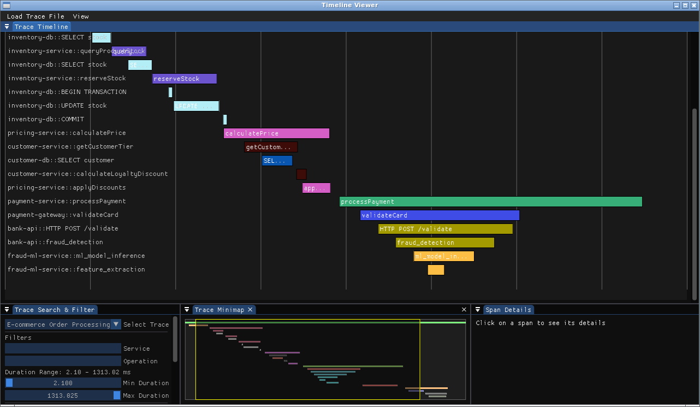

# MyLogger

[MyLogger](https://github.com/Lecrapouille/MyLogger)
is an ultra-basic but thread-safe file logger and tracer used for my GitHub C++ projects.
I initially created MyLogger to have logs in a file instead of polluting the console with
stdout and stderr. Now, after working at several companies where logs were unusable for investigating
issues and after watching the CppCon 2018: Steven Simpson [Source Instrumentation for Monitoring C++ in Production](https://www.youtube.com/watch?v=0WgC5jnrRx8) and testing [Jaeger](https://www.jaegertracing.io/)
and being disappointed, I wanted to renew this logging library to implement mine own tracer.

**Warning:** This rebirth of the library is still experimental. The API will be modified and a complete proof of concept is not entirely achieved.

## Prerequisites

- https://github.com/Lecrapouille/MyMakefile downloaded as a git submodule.
- You need to install [SFML](https://www.sfml-dev.org/) for its socket abstraction.
- Other third parties libraries are git cloned with `make download-external-libs`. They are linked against the project but are not installed directly to your operating system.

## Compilation and Installation

```bash
git clone https://github.com/Lecrapouille/MyLogger.git --recurse-submodules
cd MyLogger
make download-external-libs
make -j8
```

You can change the default compiler by passing `CXX=` to make (e.g., `make CXX=clang++-7`).

In all cases, two libraries (static and shared) and one standalone application will be created in the `build` folder. Optionally, you can install on your system:

```bash
sudo make install
```

Two libraries, one standalone application, header files, docs, and demos will be installed on your
operating system. The project will be installed in `/usr/share/MyLogger/0.3`,
compiled libraries will be installed in `/usr/lib`, and header and include files will be installed in `/usr/include/MyLogger-0.3`.

You can pass `DESTDIR` and `PREFIX` to `make install` to modify destination folders.

## Viewer

The log viewer is a standalone application that displays traces as timelines.



Currently, it can load log files. In the next version, it will open a port and listen for log messages.

## Tracer Example

See [demos](doc/demo) for complete examples on how to use the API.

The `Logger` class is a logic-less class for logging. It needs some classes to implement behaviors:

- for formatting a line of log. The current formatter will create JSON per line.
- for formatting the header and footer of a log. The current file formatter will be associated with [MyMakefile](https://github.com/Lecrapouille/MyMakefile): it will add information about the project (description, SHA1, compilation mode, version, etc.)
- for writing to a log. There are different pre-made writers: to write to console, to write to a file,
or to send via socket.

Here's a basic example:

```c++
// Create a line formatter
auto line_formatter = std::make_unique<OpenTelemetryFormatter>("console-service", "1.0.0");

// Create a file formatter that wraps the line formatter
auto file_formatter = std::make_unique<OpenTelemetryFileFormatter>(*line_formatter, "console.log");

// Create a console writer
auto writer = std::make_unique<ConsoleLogWriter<OpenTelemetryFormatter>>(*line_formatter);

// Create console logger
using ConsoleWriterType = ConsoleLogWriter<OpenTelemetryFormatter>;
using ConsoleLoggerType = Logger<ConsoleWriterType, OpenTelemetryFileFormatter, OpenTelemetryFormatter>;

ConsoleLoggerType logger(std::move(writer), std::move(line_formatter), std::move(file_formatter));
```

For each formatter, writer, and log level, you will need to include the header file.

```c++
#include "MyLogger/MyLogger.hpp"
#include "MyLogger/Strategies/Writers/ConsoleLogWriter.hpp"
#include "MyLogger/Strategies/Formatters/OpenTelemetry/OpenTelemetryLineFormatter.hpp"
#include "MyLogger/Strategies/Formatters/OpenTelemetry/OpenTelemetryFileFormatter.hpp"
#include "MyLogger/Strategies/Formatters/OpenTelemetry/OpenTelemetryLevel.hpp"
```

## Nested Trace and OpenTelemetry Format

TODO